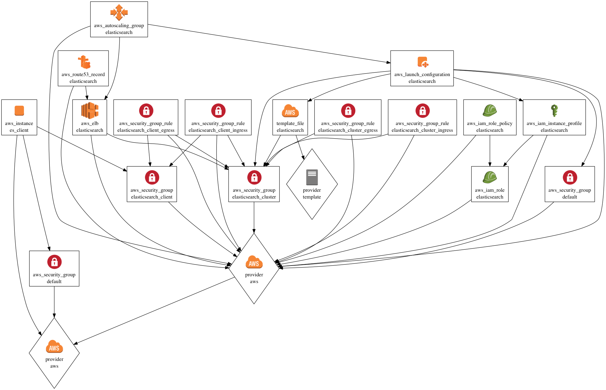

# tfp_aws_elasticsearch_cluster_and_client
A Terraform module to create an Elasticsearch cluster and client instance.


 

REQUIREMENTS
============

- Terraform v0.6.12: https://www.terraform.io/downloads.html
- An AWS account with the proper IAM credentials: https://www.terraform.io/docs/providers/aws/index.html
- A VPC with one or more subnets
- An Amazon EC2 Key Pair
- A Route53 zone

USAGE
=====

Replace the empty strings in [vars/meetup.tfvars](vars/meetup.tfvars) with the appropriate values.  Then do the following:

```bash
terraform get config && terraform apply --var-file=vars/meetup.tfvars --state=state/meetup.tfstate config
```


Documentation
=============

[VARIABLES](VARIABLES.md)

[OUTPUTS](OUTPUTS.md)
